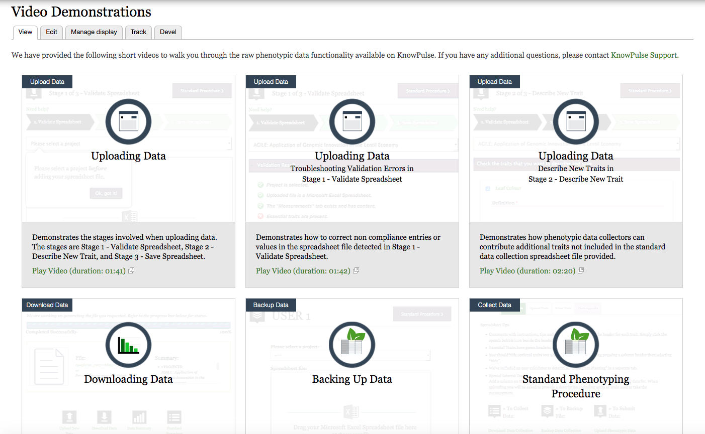
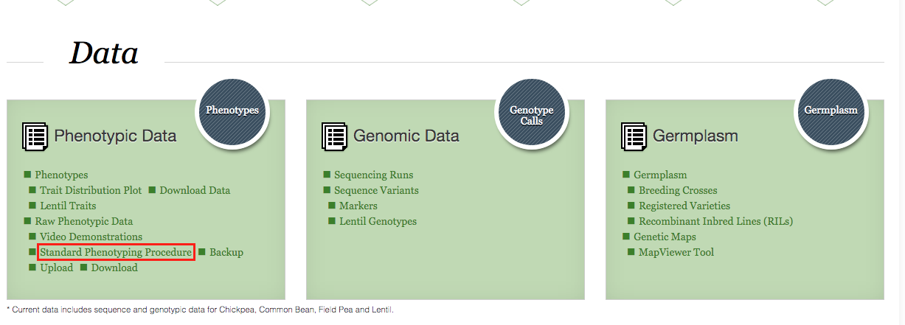
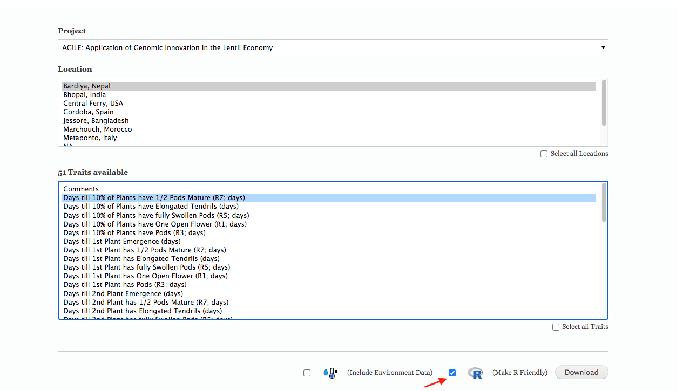

Welcome to KnowPulse. 
KnowPulse can be used to store your raw phenotypic data, we highly recommand you to store your data in KnowPulse during the growing seasonmake, and do not forget to backup your data regularly. 

Scroll down to the Data section, under the Phenotypic Data box, you can find [Video Demonstrations](https://knowpulse.usask.ca/node/1772530) for data uploade.
In these demonstration videos, you will learn the phenotypic data functionality that is available on KnowPulse.  

If you are already familar with the standard phenotyping procedures, you can have your raw phenotypic data backup, upload, and download from [here](https://knowpulse.usask.ca/phenotypes/raw/instructions)
You data is kept confidential with us, unless you choose to publish them.  

At the end of the season, you can download your data by using R-friendly headers option from KnowPulse.

