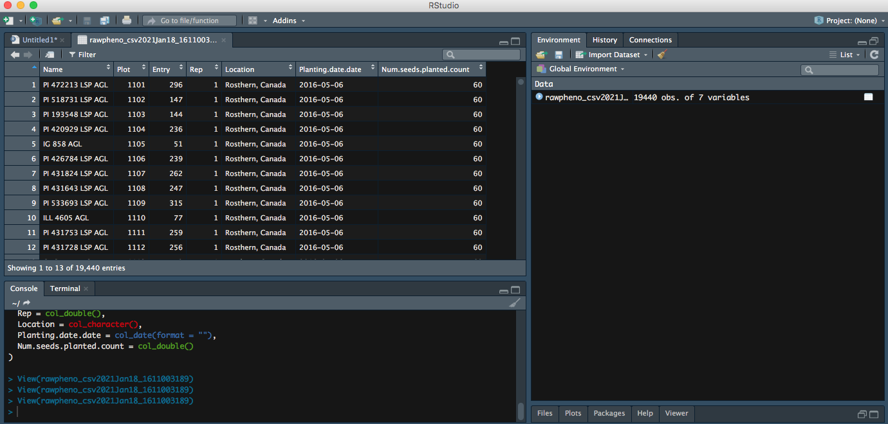

## Import your .csv file to Rstudio
After growing season, you have your data files downloaded from KnowPulse, the next step, you want to inport your .csv files into Rstudio for further analysis. 

### Step 1
Import your downloaded `.csv file` on bottom right panel to Rstudio, you will be able to see the URL of the file. 

### Step 2
Then you can preview your data, meanwhile, more **Import Options** are available for you to rename your file, or choose which sheet you would like RStudio to view.

### Step 3
It is intuitive to hit **Import** on bottom right, which is an option to import your file; as an alternate, you can also copy paste the code into the editor. 

### Step 4
Inside the bracket besdie the `library`, **readr** is the package that is used to read your file. So you want to run both lines of code.

Now your file has been successfully imported to RStudio! 

## Import your data from excel to RStudio
