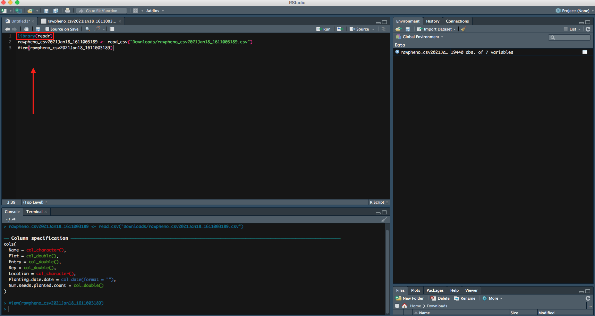

## Download your .csv from KnowPulse then import it into Rstudio
After growing season, you have your data files downloaded from KnowPulse as comma separated value `.csv`. The next step, you want to import your `.csv `files into Rstudio for further analysis. 


### Step 1
Import your downloaded `.csv file` on bottom right panel to Rstudio, you will be able to see the URL of the file. 


### Step 2
Then you can preview your data, meanwhile, more **Import Options** are available for you to rename your file, or choose which sheet you would like RStudio to view.


### Step 3
It is intuitive to hit **Import** on button right, which is an option to import your file; as an alternate, you can also copy paste the code into the editor. 


### Step 4
Inside the bracket besdie the `library`, **readr** is the package that is used to read your file. So you want to run both lines of code.

* Two ways to run your code in a script: 
1. Select the line, then hit run button on top right in `Editor` 
2. * Mac's shortcut: `command`+`enter`
   * Windows' shortcut: `control`+`enter`


Right now your file has been successfully imported to RStudio, you can continue on your data analysis. 


## Import data with `read.csv`

The following command can also be used to import your file. Let us call your file `mydata` in this case. 

### Step 1
```
mydata <- read.csv(file.choose(), header=T)
```
* `file.choose()` command allows a menu poping for you to choose your file instead of typing its full path to find it.
* `header=T`euqals to `header=TRUE` means you want to keep the first row of your dataset as variable names or headers. Otherwise, you can set `header=FALSE`

### Step 2


Now you can see your entire dataset showing up. 


## If you have Excel sheets 

For excel sheets, the package **readxl** can be used to read in sheets of data.
```
library(readxl) # install.packages("readxl")
mydata <- read_xlsx("Data.xlsx", sheet = "Data")
```
