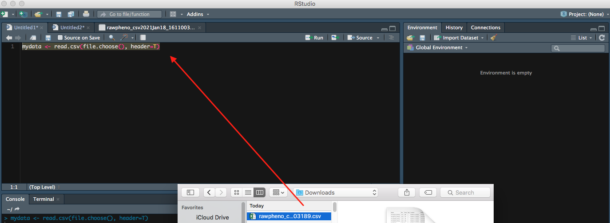

# Two options to let RStudio read your data
After the growing season, you have your data downloaded from KnowPulse in a comma separated value `.csv` format file. In the next step, you want to import your `.csv file` into Rstudio for further analysis. 

* RStudio can read files in various format, see the following episodes for more details. 

## Option 1: Import your `.csv file` with its path


### Step 1
Import your downloaded `.csv file` on bottom right panel to Rstudio, so you will be able to see the Url of your file. 


### Step 2
Then you can preview your data; meanwhile, more **Import Options** are available for you to rename your file or choose which sheet you would like RStudio to view if your file has multiple pages.


### Step 3
It is intuitive to hit **Import** button, which is an option to import your file; as an alternate, you can also copy-paste the code into the editor panel. 


### Step 4
Inside the bracket beside the `library`, **readr** is the package that is used to read your file. So you want to run both lines of code.

* Two ways to run your code in a script: 
1. Select the line, then click the run button on top right in editor panel 
2. shortcut
* Mac users: `command`+`enter`
* Windows users: `control`+`enter`
  


Right now, your file is successfully imported to RStudio; you can continue on your data analysis. 


## Option 2: Import your `read.csv` with code

The following command can also be used to import your file. Let us call your file `mydata` to make it simple. 

### Step 1
```
mydata <- read.csv(file.choose(), header=T)
```
* `file.choose()` command allows a menu poping for you to choose your file, so you donot have to type its full path to find it.
* `header=T`euqals to `header=TRUE` means you want to keep the first row of your dataset as variable names or headers. Otherwise, you can set `header=FALSE`

### Step 2


Now you can see your entire dataset showing up. 


