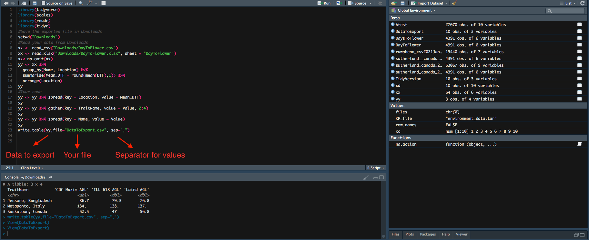
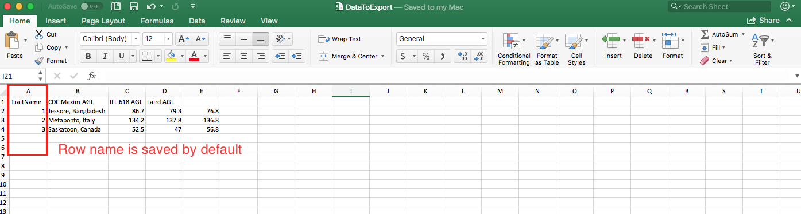
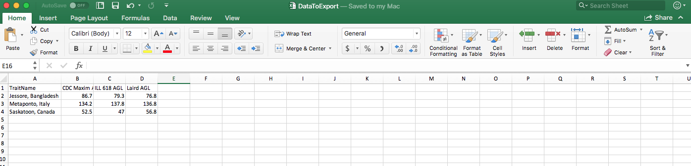

## `Work.table` Command to export your data from R

### We are aiming to output the `.csv` file we have tidied from last episode.

```
#Save the exported file in Downloads
setwd("Downloads")
#Read your data from Downloads
xx <- read_csv("Downloads/DayToFlower.csv")
xx <- read_xlsx("Downloads/DayToFlower.xlsx", sheet = "DayToFlower")
xx<-na.omit(xx)
yy <- xx %>%
  group_by(Name, Location) %>%
  summarise(Mean_DTF = round(mean(DTF),1)) %>% 
  arrange(Location)
yy
#Your coad
yy <- yy %>% spread(key = Location, value = Mean_DTF)
yy
yy <- yy %>% gather(key = TraitName, value = Value, 2:4)
yy
yy <- yy %>% spread(key = Name, value = Value)
yy
write.table(yy,file="DataToExport.csv", sep=",")
```


## Now your `DataToExport.csv` is saved in Downloads.


## To remove row name
```
write.table(yy,file="DataToExport.csv", row.names=F, sep=",")
```

* The old file is overwritten by the new one, so you only get one `DataToExport.csv`. 
* Exported file can be saved in different formats through change of the separator.
Check [Export Data from R](https://www.youtube.com/watch?v=WjpcbmcJjjM) for details. 
