## Basic Grahics
1. Basic X-Y plotting
### We will start with some basic plotting using the base function `plot()`

### Load a data frame into R
```
xd <- data.frame(
  x1 = c("aa","bb","cc","dd","ee",
         "ff","gg","hh","ii","jj"),
  x2 = 1:10,
  x3 = c(1,1,1,1,1,2,2,2,3,3),
  x4 = rep(c(1,2), times = 5),
  x5 = rep(1:5, times = 2),
  x6 = rep(1:5, each = 2),
  x7 = seq(5, 50, by = 5),
  x8 = log10(1:10),
  x9 = (1:10)^3,
  x10 = c(T,T,T,F,F,T,T,F,F,F)
)
xd
```
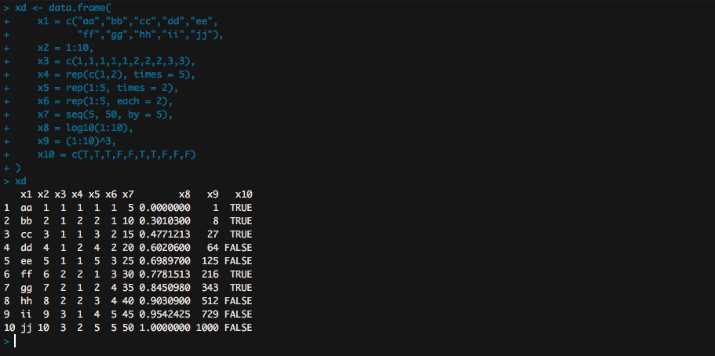

### Basic Scatter Plot


```
A basic scatter plot
plot(x = xd$x8, y = xd$x9)
```
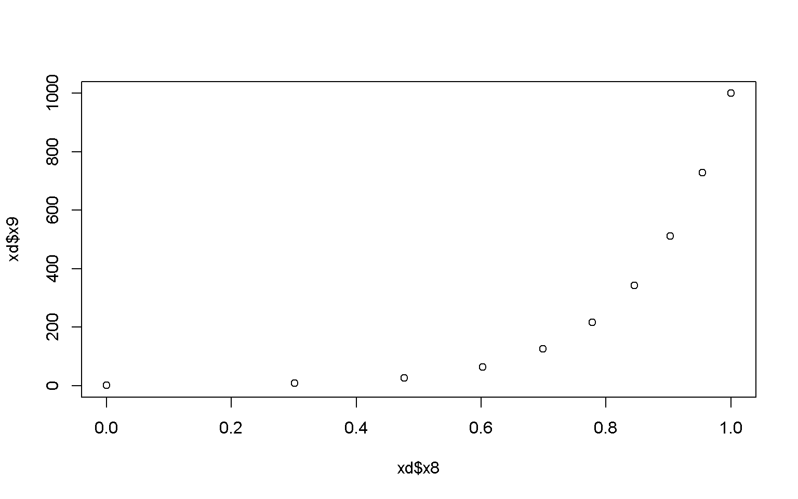

```
# Adjust color and shape of the points
plot(x = xd$x8, y = xd$x9, col = "darkred", pch = 0)
```
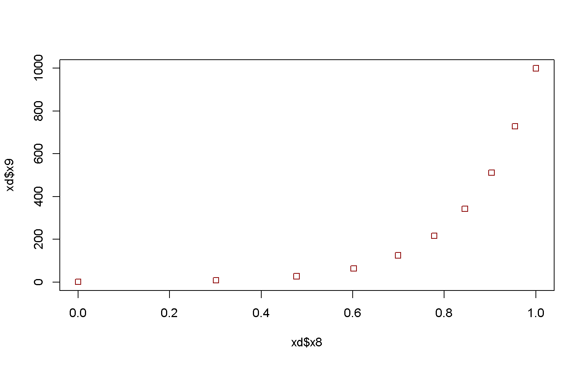

```
plot(x = xd$x8, y = xd$x9, col = xd$x4, pch = xd$x4)
```
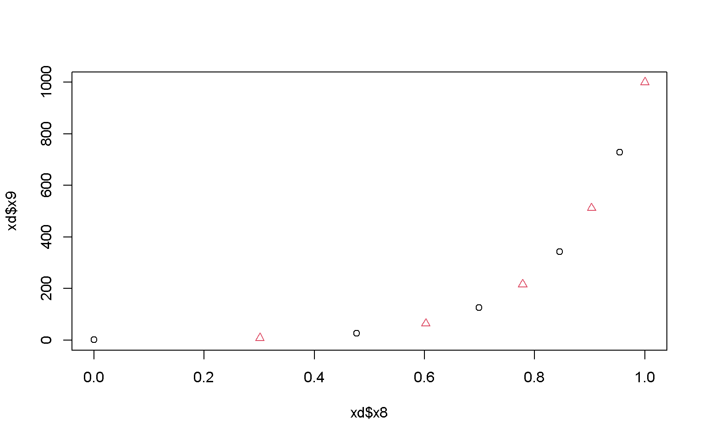

```
# Adjust plot type 
plot(x = xd$x8, y = xd$x9, type = "line")
```


```
# Adjust linetype
plot(x = xd$x8, y = xd$x9, type = "line", lty = 2)
```
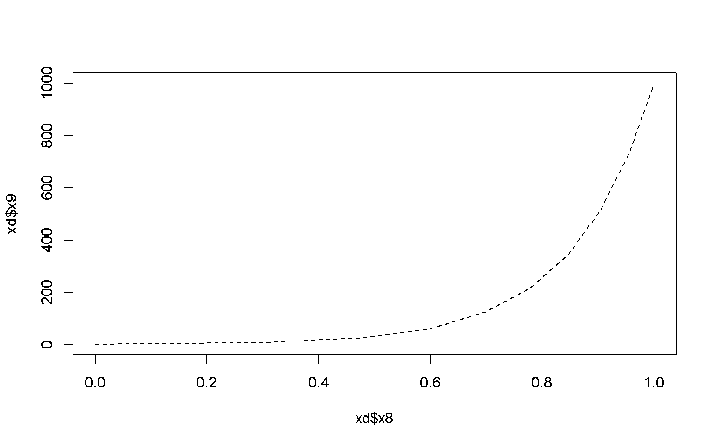

```
# Plot lines and points
plot(x = xd$x8, y = xd$x9, type = "both")
```
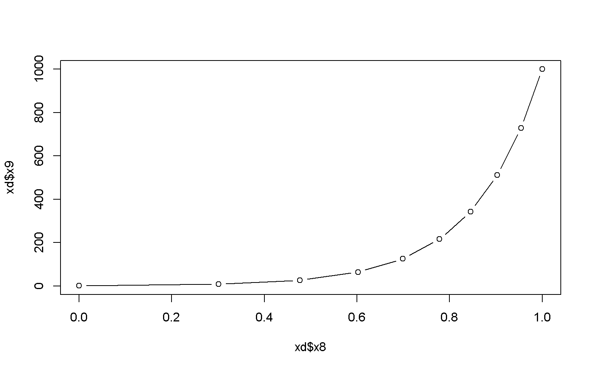

How about we now create some random and normally distributed data to make some more complicated plots:

```
# 100 random uniformly distributed numbers ranging from 0 - 100
ru <- runif(100, min = 0, max = 100)
ru
```
```
##   [1] 93.7792722  5.2058264 69.3092606 87.8757695 93.3245922 67.9051869 46.9099487 35.5891664 74.7797008  2.7596956 53.4739481 92.1409410
##  [13]  8.9753618 45.5635354 71.3770539 16.3657328 51.0398228 13.4896518 12.4459450 25.7143970 68.1830481 40.4708243 74.0677972 59.2101567
##  [25] 38.7055322 48.5972122 27.1599634 69.2195419 80.2855715  9.1769648 31.2876002 79.9755078  8.4545997 47.5581250  6.5751686 71.1780116
##  [37] 49.5609812  0.6333086 67.3160462 76.7686795 94.2319493  3.2416026 27.0022919 77.9143718 83.3589595 45.0760499 57.9321392 40.9880216
##  [49] 93.9983372 68.8077655 30.6024296 12.3127829 90.7924286 45.3508709 50.4629388  6.7605921 30.6151922 92.4777183 80.2674523 20.9279168
##  [61] 89.8962399  0.5688416 66.3812347 63.3058209 86.7850871 31.7576001 82.8562194 49.3832795 83.5812209  5.6286126 90.5950977 30.5509194
##  [73] 91.2311482 96.7813272 24.4044569 94.8301130 95.8874951 86.4078381 26.7188237 10.4742400  0.3250012  8.2367471 77.0652131 16.9814142
##  [85] 60.8751291 71.5650256  4.8838718 76.2454340 68.9297517 27.1255990 20.9791733 39.2620779 57.4075861 84.4399911 91.8024827 15.0074634
##  [97] 39.4713569 27.2310661 35.9280103 80.9529896
```
```
plot(x = ru)
```
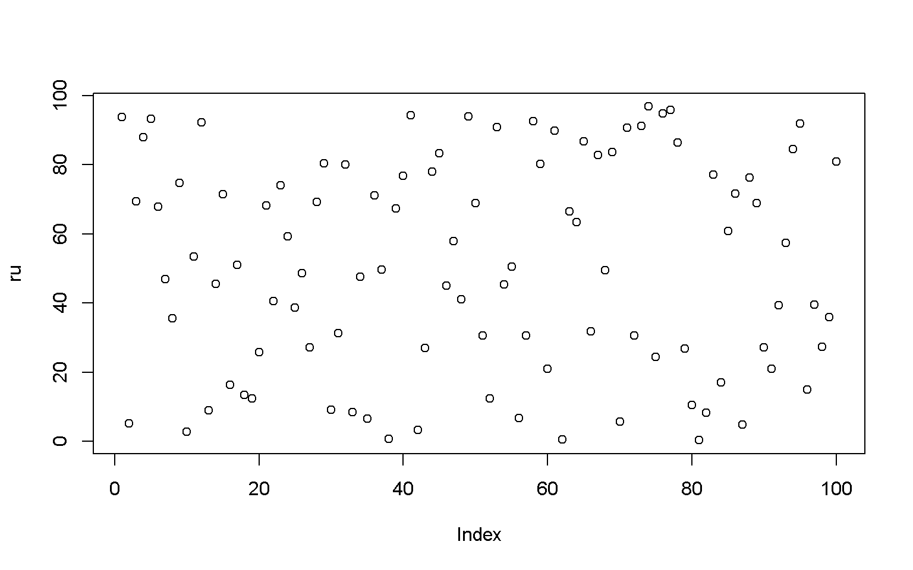

```
order(ru)
```
```
##   [1]  81  62  38  10  42  87   2  70  35  56  82  33  13  30  80  52  19  18  96  16  84  60  91  75  20  79  43  90  27  98  72  51  57
##  [34]  31  66   8  99  25  92  97  22  48  46  54  14   7  34  26  68  37  55  17  11  93  47  24  85  64  63  39   6  21  50  89  28   3
##  [67]  36  15  86  23   9  88  40  83  44  32  59  29 100  67  45  69  94  78  65   4  61  71  53  73  95  12  58   5   1  49  41  76  77
## [100]  74
```
```
ru<- ru[order(ru)]
ru
```
```
##   [1]  0.3250012  0.5688416  0.6333086  2.7596956  3.2416026  4.8838718  5.2058264  5.6286126  6.5751686  6.7605921  8.2367471  8.4545997
##  [13]  8.9753618  9.1769648 10.4742400 12.3127829 12.4459450 13.4896518 15.0074634 16.3657328 16.9814142 20.9279168 20.9791733 24.4044569
##  [25] 25.7143970 26.7188237 27.0022919 27.1255990 27.1599634 27.2310661 30.5509194 30.6024296 30.6151922 31.2876002 31.7576001 35.5891664
##  [37] 35.9280103 38.7055322 39.2620779 39.4713569 40.4708243 40.9880216 45.0760499 45.3508709 45.5635354 46.9099487 47.5581250 48.5972122
##  [49] 49.3832795 49.5609812 50.4629388 51.0398228 53.4739481 57.4075861 57.9321392 59.2101567 60.8751291 63.3058209 66.3812347 67.3160462
##  [61] 67.9051869 68.1830481 68.8077655 68.9297517 69.2195419 69.3092606 71.1780116 71.3770539 71.5650256 74.0677972 74.7797008 76.2454340
##  [73] 76.7686795 77.0652131 77.9143718 79.9755078 80.2674523 80.2855715 80.9529896 82.8562194 83.3589595 83.5812209 84.4399911 86.4078381
##  [85] 86.7850871 87.8757695 89.8962399 90.5950977 90.7924286 91.2311482 91.8024827 92.1409410 92.4777183 93.3245922 93.7792722 93.9983372
##  [97] 94.2319493 94.8301130 95.8874951 96.7813272
```

```
plot(x = ru)
```
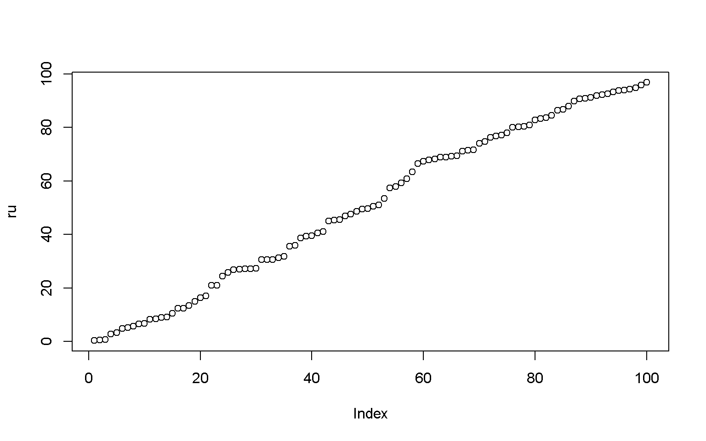

```
# 100 normally distributed numbers with a mean of 50 and sd of 10
nd <- rnorm(100, mean = 50, sd = 10)
nd
```
```
##   [1] 38.40931 54.50517 61.00758 48.24371 55.05703 50.19036 75.92284 65.39284 58.75954 42.96810 45.87521 58.25970 47.82696 45.19008
##  [15] 54.57716 43.44305 67.67423 55.49420 42.37655 68.21933 49.80417 54.71856 33.31593 34.93320 46.63470 53.88502 48.86226 47.84021
##  [29] 65.98524 61.40776 40.74877 26.02507 30.57845 51.05247 43.76863 83.17006 25.25972 51.80369 54.21798 68.06235 53.69070 34.84286
##  [43] 64.18536 60.73534 58.38647 60.15617 53.86052 33.32625 49.78303 54.79121 42.29689 44.92490 57.54842 49.39659 65.47622 62.40080
##  [57] 58.58921 57.18908 48.48429 40.02540 49.49290 47.99492 59.49275 52.43222 64.25810 75.30217 72.62295 33.67732 81.02630 61.60500
##  [71] 61.17238 36.94567 32.65669 60.83920 54.88921 50.03472 66.01779 40.95968 65.58695 56.29101 48.98033 39.95974 50.33351 57.50313
##  [85] 44.06732 59.69696 45.56645 41.10511 46.04440 43.69505 64.95305 52.92210 53.65435 62.51068 52.27743 65.31862 72.85238 53.81886
##  [99] 49.44123 50.25871
```
```
nd <- nd[order(nd)]
nd
```
```
##   [1] 25.25972 26.02507 30.57845 32.65669 33.31593 33.32625 33.67732 34.84286 34.93320 36.94567 38.40931 39.95974 40.02540 40.74877
##  [15] 40.95968 41.10511 42.29689 42.37655 42.96810 43.44305 43.69505 43.76863 44.06732 44.92490 45.19008 45.56645 45.87521 46.04440
##  [29] 46.63470 47.82696 47.84021 47.99492 48.24371 48.48429 48.86226 48.98033 49.39659 49.44123 49.49290 49.78303 49.80417 50.03472
##  [43] 50.19036 50.25871 50.33351 51.05247 51.80369 52.27743 52.43222 52.92210 53.65435 53.69070 53.81886 53.86052 53.88502 54.21798
##  [57] 54.50517 54.57716 54.71856 54.79121 54.88921 55.05703 55.49420 56.29101 57.18908 57.50313 57.54842 58.25970 58.38647 58.58921
##  [71] 58.75954 59.49275 59.69696 60.15617 60.73534 60.83920 61.00758 61.17238 61.40776 61.60500 62.40080 62.51068 64.18536 64.25810
##  [85] 64.95305 65.31862 65.39284 65.47622 65.58695 65.98524 66.01779 67.67423 68.06235 68.21933 72.62295 72.85238 75.30217 75.92284
##  [99] 81.02630 83.17006
```
```
plot(x = nd)
```
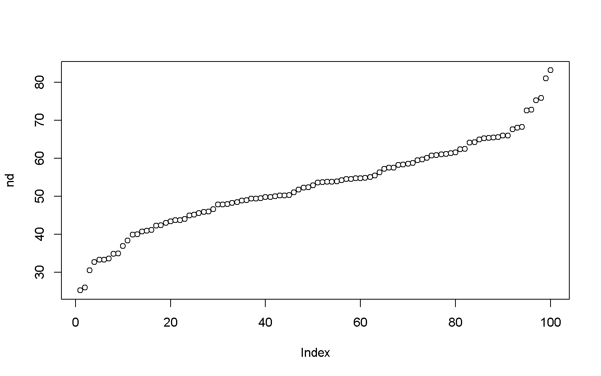

### Histogram

```
hist(x = nd)
```
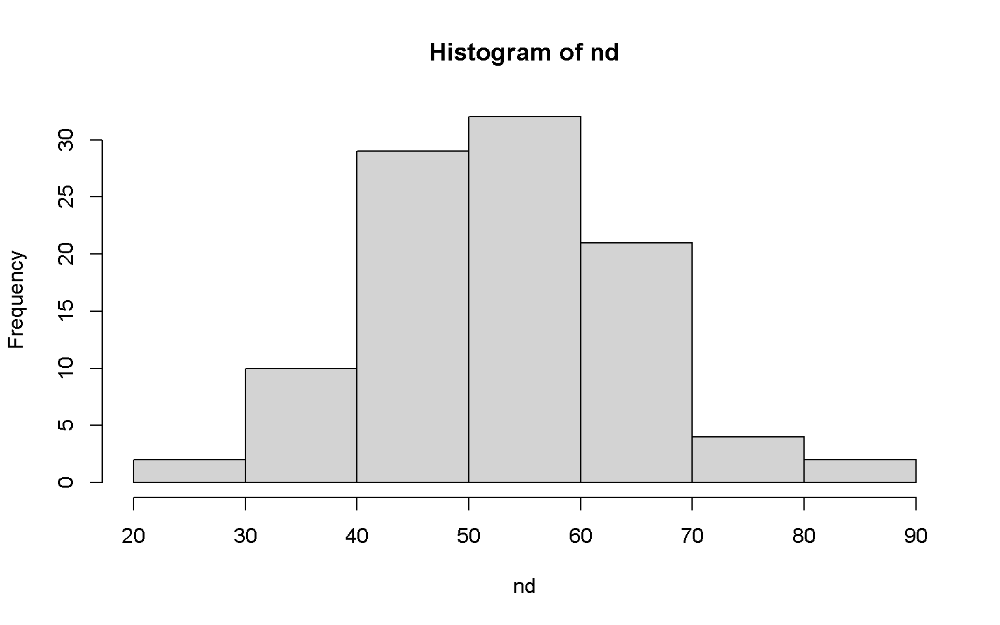

```
hist(nd, breaks = 20, col = "darkgreen")
```
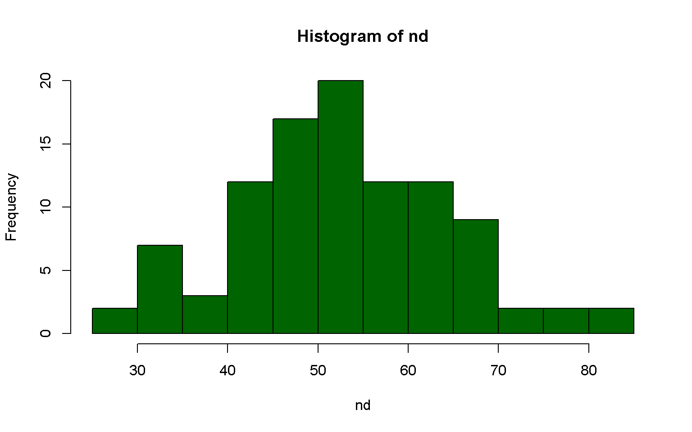

```
plot(x = density(nd))
```
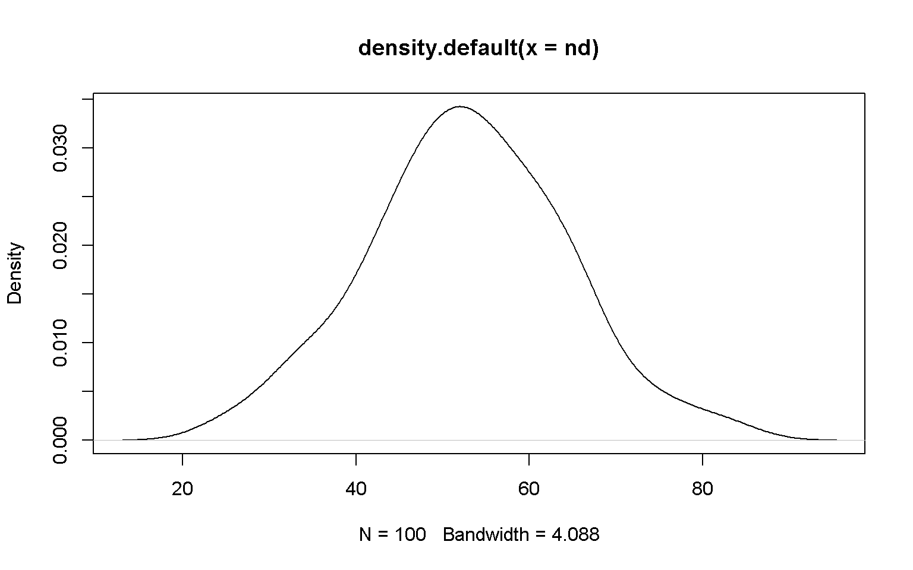

### Boxplot
```
boxplot(x = nd)
```
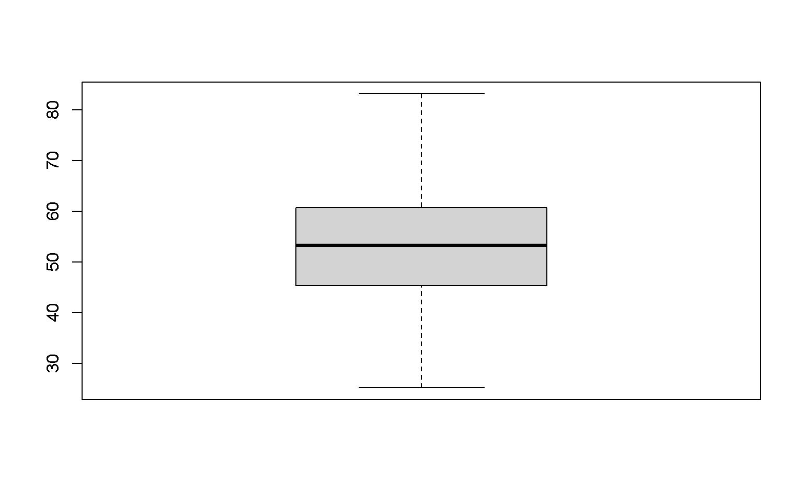

```
boxplot(x = nd, horizontal = T)
```
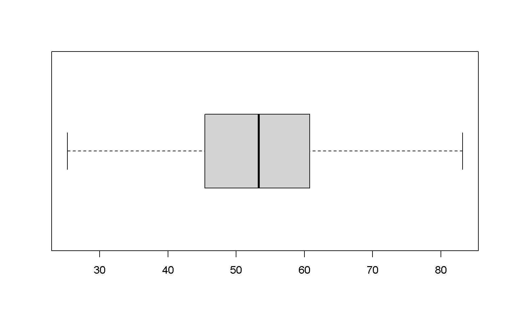
